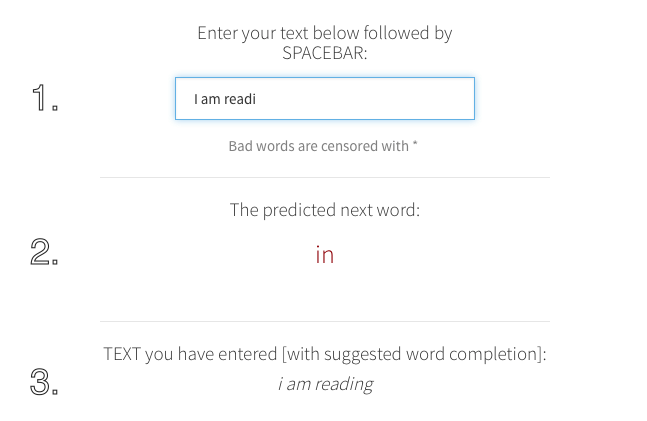

### Coursera Data Science Capstone Project

This application is the capstone project for the Coursera Data Science specialization held by Johns Hopkins University in cooperation with SwiftKey.

******

#### Objective to Project

The main goal of this capstone project is to build a shiny application that is able to predict the next word from a corpus called [HC Corpora](http://www.corpora.heliohost.org/). 

All text mining and natural language processing was done with the usage of a variety of well-known R packages.

******

#### Applied Methods & Models

After creating a data samples from the HC Corpora data, this samples are cleaned by removing punctuation, links, white space, numbers and all kinds of special characters etc. The sampled data are then tokenized into n-grams.
> In the fields of computational linguistics and probability, an n-gram is a contiguous sequence of n items from a given sequence of text or speech. ([Source](http://en.wikipedia.org/wiki/N-gram))

Those aggregated bi-,tri-gram term frequency matrices are transferred into frequency dictionaries.

The resulting data frames are used to predict the next word in connection with the text input by a user of the described application and the frequencies of the underlying *n*-grams table.

******

#### Usage Of The Application

<i>The user interface of this application works as follows: </i>  
When the text (**1**) is entered, the field with the predicted next word (**2**) refreshes instantaneously and  also the whole text input (**3**) gets displayed with suggested completion work as shown below in the diagram.

******

#### Additional Information

* The next word prediction app is hosted on shinyapps.io: [https://gkgm.shinyapps.io/PredictNextWord](https://gkgm.shinyapps.io/PredictNextWord)

* The whole code of this application, as well as all the milestone report, related scripts, this presentation  etc. can be found in this GitHub repo: [https://github.com/gkgm/Capstone_Milestone_Project](https://github.com/gkgm/Capstone_Milestone_Project)

* This pitch deck is located here: [http://rpubs.com/gkgm/PredictNextWord](http://rpubs.com/gkgm/PredictNextWord)

* Learn more about the Coursera Data Science Specialization: [https://www.coursera.org/specialization/jhudatascience/1](https://www.coursera.org/specialization/jhudatascience/1)
